  

  <a href="https://www.linkedin.com/in/swanoop-r/">LinkedIn</a>
  &nbsp;·&nbsp;
  <a href="https://medium.com/@rswanoop">Medium</a>
  &nbsp;·&nbsp;
  United Kingdom

## About

I am a Cyber Security Engineer specialising in Operational Technology and Industrial Control Systems. My work covers cyber risk assessment, security strategy, architecture review and engineering assurance for operational systems.

I focus on understanding how a system operates, where it is exposed and what measures are required to manage cyber risk. This includes defining system boundaries and essential functions, reviewing network architecture, developing zones and conduits, assessing threat scenarios and translating standards into practical security requirements.

Alongside my professional work, I develop tools for industrial network analysis, telemetry simulation and security testing. These projects allow me to explore OT security problems through practical engineering, data analysis and controlled experimentation.

## Engineering approach

| Understand | Assess | Engineer | Assure |
|:---|:---|:---|:---|
| System boundaries | Threat scenarios | Zones and conduits | Architecture review |
| Essential functions | Vulnerabilities | Security requirements | Security testing |
| Assets and interfaces | Likelihood and consequence | Risk treatment | Evidence and residual risk |

## Selected projects

<table>
  <tr>
    <td width="50%" valign="top">
      <h3><a href="https://github.com/swanoop/OTScope">OTScope</a></h3>
      
Passive industrial network behaviour and security profiling for PCAP and PCAPNG captures.

      
<code>PCAP</code> <code>Modbus/TCP</code> <code>IEC 104</code> <code>S7comm</code> <code>Zones &amp; Conduits</code>

    </td>
    <td width="50%" valign="top">
      <h3><a href="https://github.com/swanoop/RailCAN">RailCAN</a></h3>
      
Correlated CAN telemetry and fault simulation for analysis, demonstrations and controlled test environments.

      
<code>CAN</code> <code>Telemetry</code> <code>Fault Injection</code> <code>SocketCAN</code> <code>Python</code>

    </td>
  </tr>
</table>

## Areas of practice

| Cyber risk and assurance | Architecture and resilience | Analysis and testing |
|:---|:---|:---|
| OT cyber risk assessment | System boundary and SuC definition | Industrial traffic analysis |
| Cybersecurity strategy and CSMPs | Architecture and topology review | Threat and vulnerability analysis |
| Gap and maturity assessment | Zones, conduits and segmentation | Technical assurance |
| Incident response and continuity planning | Security requirements and risk treatment | Security testing |

## Standards and frameworks

`IEC 62443` · `CLC/TS 50701` · `NCSC CAF` · `UK NIS Regulations` · `ISO 27001` · `NIST SP 800-61`

## Professional involvement

- ISA UK Section Cybersecurity Chair and Board Member
- Member of the NCSC ICS Community of Interest, Security Testing Expert Group
- ISA/IEC 62443 Cybersecurity Fundamentals Specialist
- ISA/IEC 62443 Cybersecurity Risk Assessment Specialist
- Member of BCS and the Institution of Engineering and Technology
- MSc Cybersecurity and Forensics, University of Westminster

  From system context to security assurance.

